# 测试报告：RFC-001 — 对话交互

## 报告信息

| 字段 | 值 |
|------|-----|
| RFC | RFC-001 |
| 提交 | `bdea03c` |
| 日期 | 2026-02-27 |
| 测试人 | AI（OpenCode） |
| 状态 | PASS |

## 概述

RFC-001 实现了完整的对话交互循环：来自 OpenAI、Anthropic（含 thinking blocks）和 Gemini 的 SSE 流式传输；`SendMessageUseCase` 中的多轮工具调用循环；以及完整的 Gemini 风格聊天 UI，包含消息气泡、工具调用卡片、思考块、流式光标和 Agent 选择器。所有可行的测试层均已成功执行。

| 层 | 步骤 | 结果 | 说明 |
|----|------|------|------|
| 1A | JVM 单元测试 | PASS | 245 个测试，0 个失败 |
| 1B | 设备 DAO 测试 | PASS | 48 个测试，0 个失败 |
| 1C | Roborazzi 截图测试 | PASS | 8 张新截图 |
| 2 | adb 视觉验证 | PASS | Flow 1-1 至 1-9 全部通过（修复 3 个 Bug 后） |

## Layer 1A：JVM 单元测试

**命令：** `./gradlew test`

**结果：** PASS

**测试数量：** 245 个测试，0 个失败

主要变更：
- `OpenAiAdapterTest.sendMessageStream returns a Flow without throwing` — 替换了过时的"throws NotImplementedError"测试。该方法现在返回 `Flow<StreamEvent>`，此测试验证它不会抛出异常。
- 所有现有适配器测试（listModels、testConnection、generateSimpleCompletion）继续通过。

## Layer 1B：设备测试

**命令：** `ANDROID_SERIAL=emulator-5554 ./gradlew connectedAndroidTest`

**结果：** PASS

**设备：** Medium_Phone_API_36.1（AVD）— emulator-5554

**测试数量：** 48 个测试，0 个失败

RFC-001 未新增设备测试（Chat 逻辑在适配器层可进行单元测试；DAO 层无变更）。

## Layer 1C：Roborazzi 截图测试

**命令：**
```bash
./gradlew recordRoborazziDebug
./gradlew verifyRoborazziDebug
```

**结果：** PASS

在 `AgentScreenshotTest`（RFC-001 和 RFC-002 共享文件）中录制的新截图：

### ChatTopBar


视觉检查：左侧汉堡菜单图标；中央"General Assistant"标题带下拉箭头（金/琥珀色文字）；右侧设置齿轮图标。

### ChatInput — 空状态


视觉检查：带"Message"占位符的边框输入框；无文字时发送按钮禁用（灰色）。

### ChatInput — 含文字


视觉检查：输入框中显示文字；发送按钮启用（有颜色）。

### ChatEmptyState


视觉检查：无消息时显示居中的空状态占位符。

### MessageList — 对话


视觉检查：用户消息以金/琥珀色圆角气泡显示在右侧；AI 回复以 Surface 色卡片显示在左侧，Markdown 渲染正确（**粗体**显示正常）；AI 消息下方显示模型 ID "gpt-4o" 及复制/重新生成图标。

### MessageList — 工具调用


视觉检查：用户消息气泡，然后是显示工具名称"get_current_time"的 TOOL_CALL 卡片，再是显示输出的 TOOL_RESULT 卡片，最后是 AI 最终回复。

### MessageList — 流式传输中


视觉检查：用户消息气泡，然后是 AI 气泡中显示的流式文字（流式光标可见）。

### MessageList — 活跃工具调用


视觉检查：用户消息气泡，然后是显示 PENDING 状态的活跃 TOOL_CALL 卡片，工具名"read_file"及参数可见。

## Layer 2：adb 视觉验证

**结果：** PASS（修复 3 个 Bug 后，全部流程通过）

**设备：** Pixel 6a，Android 16

**Provider：** Anthropic（`claude-sonnet-4-6`；Flow 1-9 使用 `claude-opus-4-5-20251101`）

**执行流程：** Flow 1-1 至 Flow 1-9（RFC-001 定义的全部流程）

| 流程 | 描述 | 结果 | 说明 |
|------|------|------|------|
| Flow 1-1 | 发送消息 — 流式响应出现 | PASS | |
| Flow 1-2 | 流式传输完成 — 操作行和模型标签出现 | PASS | |
| Flow 1-3 | 停止生成 — 按钮恢复，部分文字保留 | PASS | |
| Flow 1-4 | 重新生成响应 | PASS | |
| Flow 1-5 | 键盘弹出 — TopAppBar 保持可见 | PASS | Bug 已修复：`adjustNothing` + `imePadding` 应用于 ChatInput |
| Flow 1-6 | 长按用户消息复制 | PASS | Bug 已修复：`DisableSelection` + 显式 `interactionSource` |
| Flow 1-7 | 工具调用循环 — ToolCallCard 和 ToolResultCard 可见 | PASS | |
| Flow 1-8 | 错误消息 — 错误卡片和重试按钮可见 | PASS | 小问题：错误卡片显示原始 JSON，见已知问题 |
| Flow 1-9 | 思考块 — 折叠与展开 | PASS | Bug 已修复：请求体中加入 thinking 配置 |

---

### Flow 1-1：发送消息 — 流式响应出现

**结果：** PASS

**步骤与观察：**

**Step 1 — Chat 屏幕打开**


TopAppBar 可见（汉堡菜单、"General Assistant" 标题带下拉箭头、设置图标）。屏幕中央显示空状态"How can I help you today?"。底部输入框和发送按钮正常显示。无"未配置 Provider"Snackbar — Provider 已配置。

**Step 2 — 消息已输入**


"Hello, who are you?" 已输入至胶囊形输入框。发送按钮激活（金/琥珀色填充）。键盘可见。

**Step 4a — 发送后立即（0.5 秒）：停止按钮可见，流式传输已启动**


用户消息气泡右对齐出现（金色）。下方 AI 响应开始（第一条消息的回复已完成显示 — 模型响应较快）。输入区底部右侧可见**停止按钮（红色方块图标）**。输入框禁用（"Message"占位符，不可编辑）。

**Step 4b — 流式传输进行中（1.2 秒）：Markdown 渲染 + 闪烁光标**


流式 AI 气泡显示完整渲染的 Markdown：H1 标题（"Neural Networks & Backpropagation: A Detailed Explanation"）、H2 章节标题（"1. The Big Picture"）、**加粗**和*斜体*文字渲染正确。文字末尾可见闪烁光标 `|`（流式传输进行中）。停止按钮持续显示。

**Step 4c — 流式传输继续（1.7 秒）**


可见之前已完成的对话（第一条"Hello, who are you?"消息及其完整回复和操作行）。新的用户消息气泡（反向传播问题）可见。停止按钮存在 — 新消息正在流式传输中。

**Step 5 — 流式传输完成：发送按钮恢复**

流式传输在约 4 秒内完成。停止按钮消失；发送按钮（箭头图标，输入框为空时变暗）重新出现。

**Step 6 — 最终状态：操作行和模型标签**


已完成 AI 响应的末尾。消息气泡下方：复制图标、重新生成图标、模型标签 **`claude-sonnet-4-6`** 均可见。输入区显示发送按钮（非停止按钮），确认流式传输已完成。

---

**额外观察：**
- Markdown 渲染端到端正常：H1/H2 标题、加粗、斜体、无序列表均正确渲染。
- 数学符号（如 `max(0,z)`）回退为纯文本 — 符合预期，Markdown 库不支持 LaTeX。
- "Hello, who are you?" 响应过快（1.5 秒内已完成），因此使用了较长的问题以稳定捕获流式中间状态。

---

### Flow 1-2：流式传输完成 — 操作行和模型标签出现

**结果：** PASS

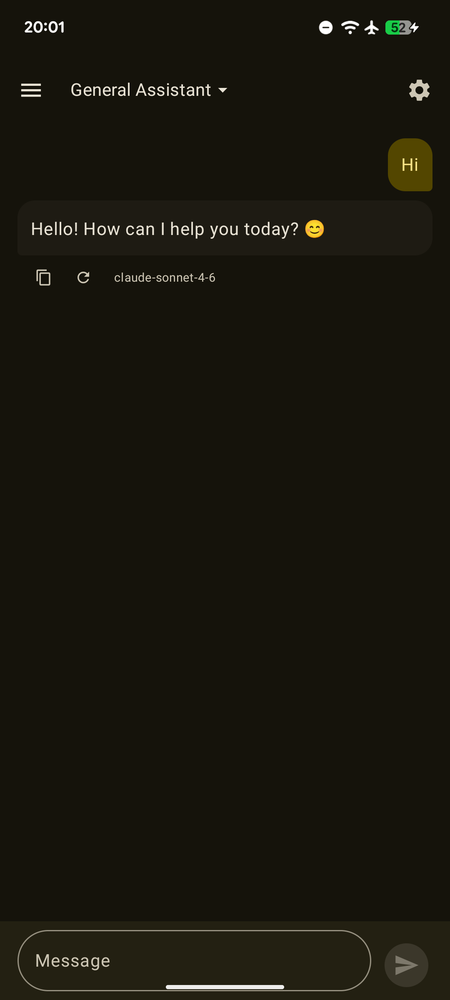

流式传输完成后：AI 响应气泡含文字。下方：复制图标、重新生成图标（循环箭头）、模型标签 `claude-sonnet-4-6`。发送按钮（非停止按钮）确认流式传输已完成。

---

### Flow 1-3：停止生成 — 按钮恢复，部分文字保留

**结果：** PASS

**流式传输中（停止按钮可见）：**

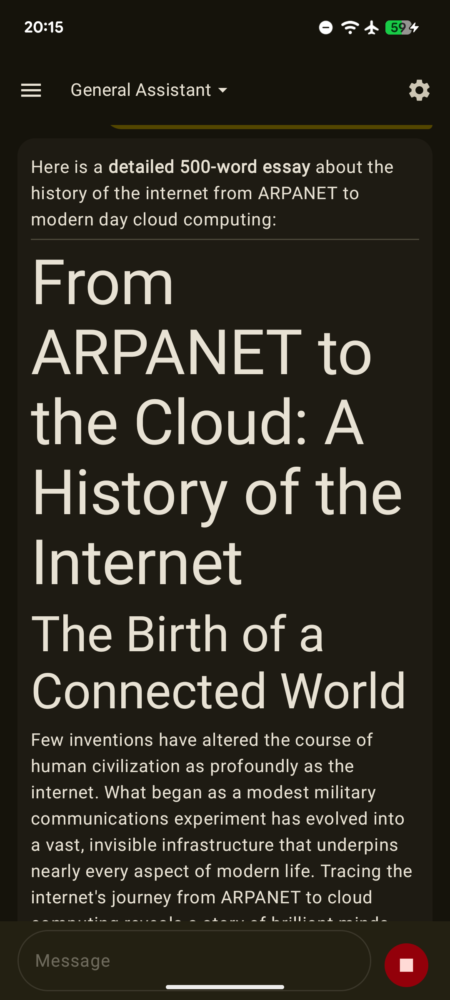

输入区右下角可见停止按钮（红色方块）。AI 响应正在流式传输 — 部分文章文字及标题段落可见。

**点击停止后：**

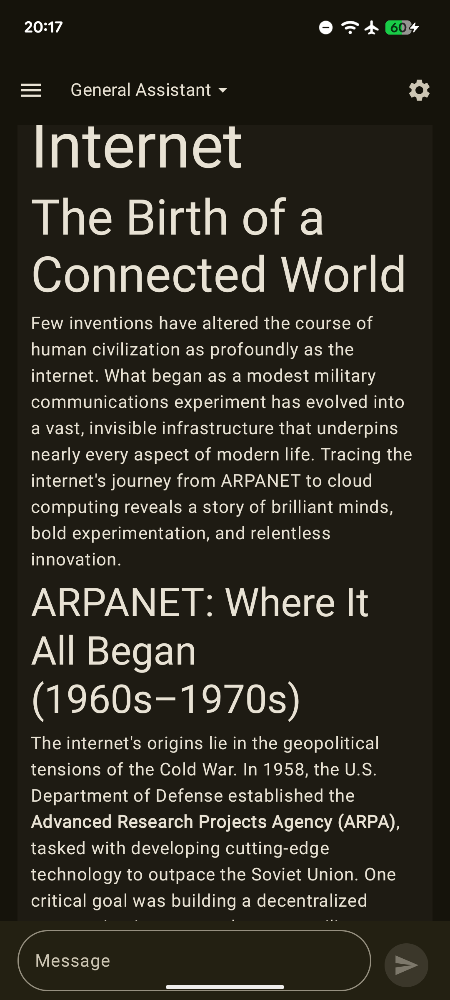

停止按钮恢复为发送按钮。部分 AI 响应保留在对话中。输入框重新启用。

---

### Flow 1-4：重新生成响应

**结果：** PASS

**重新生成前的操作行：**

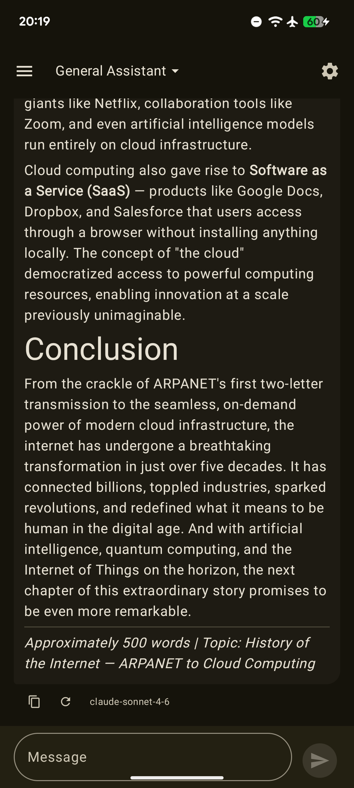

已完成 AI 响应及操作行，显示复制、重新生成和模型标签。

**点击重新生成后的流式传输：**

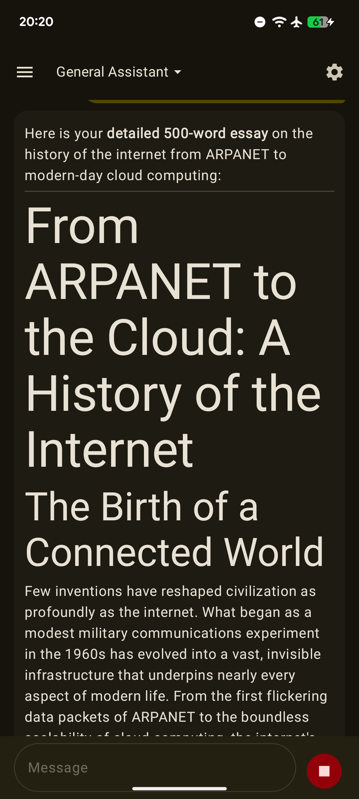

前一条响应被新的流式响应替换。停止按钮可见。

**新响应完成：**

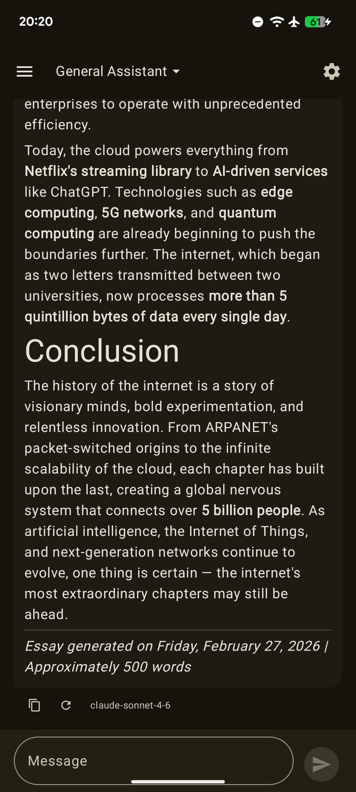

新 AI 响应含操作行。模型标签 `claude-sonnet-4-6` 可见。

---

### Flow 1-5：键盘弹出 — TopAppBar 保持可见

**结果：** PASS（本次 session 修复 Bug）

**键盘弹出前：**


TopAppBar 完整可见：左侧汉堡菜单、中央"General Assistant"、右侧设置齿轮。

**键盘弹出后：**

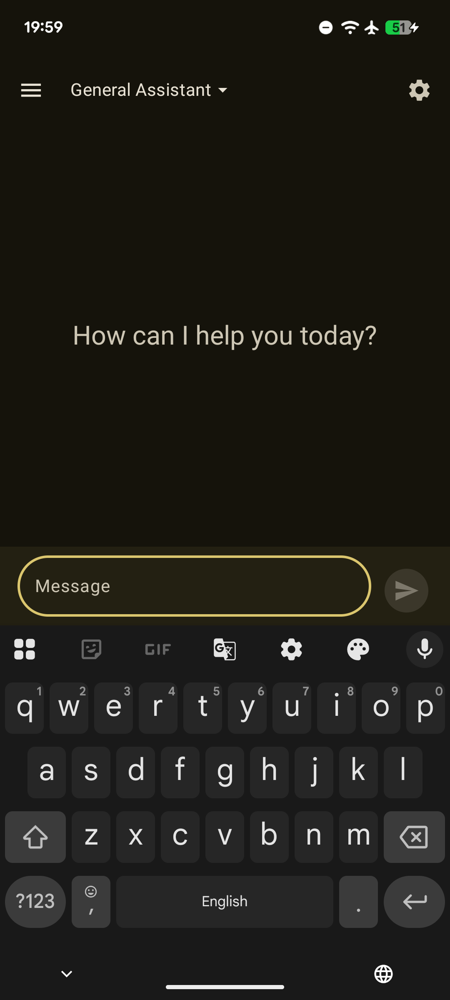

TopAppBar 仍完整可见于顶部。键盘上方显示输入框和发送按钮。TopAppBar 与输入框之间可见空状态文字。

**修复方案：** 在 `AndroidManifest.xml` 中设置 `android:windowSoftInputMode="adjustNothing"`，并在 `ChatInput` 的 `Surface` 上添加 `Modifier.imePadding()`，替换原先 `Scaffold` 上的 `contentWindowInsets = WindowInsets.ime.union(WindowInsets.navigationBars)`。

---

### Flow 1-6：长按用户消息复制

**结果：** PASS（本次 session 修复 Bug）

**长按前：**

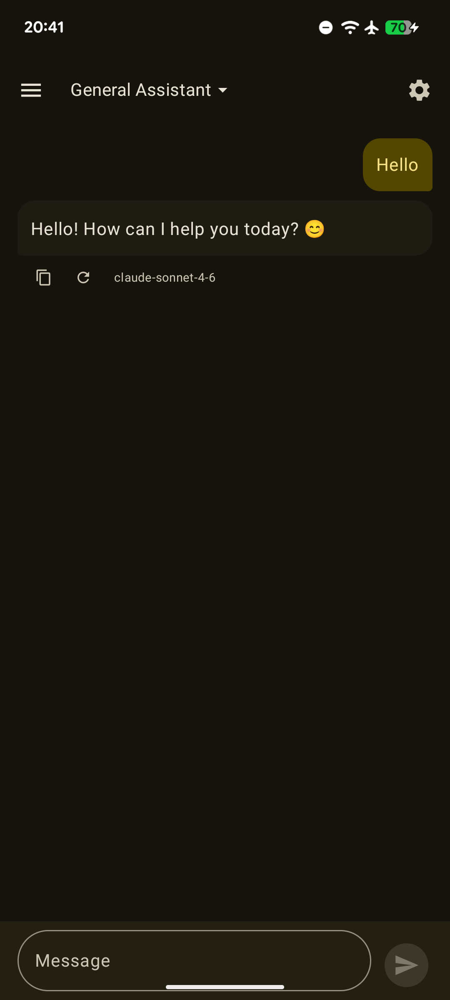

用户消息气泡（金色，右对齐）在对话中可见。

**长按后：**

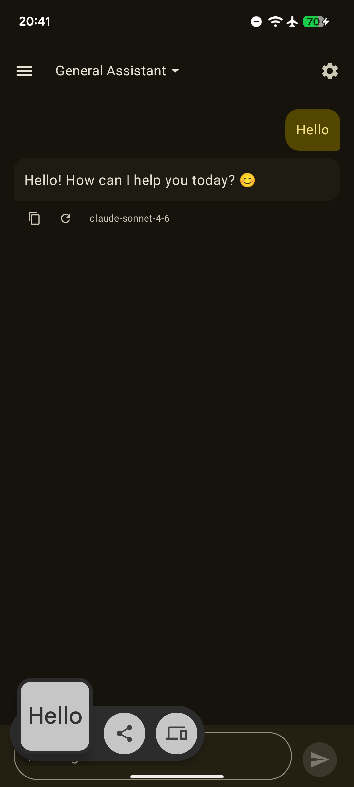

底部出现 Android 13+ 剪贴板确认 UI：已复制文字预览（"Hello"）及分享、复制到剪贴板操作按钮。

**修复方案：** 在 `UserMessageBubble` 和 `AiMessageBubble` 中为 `Text` 添加 `DisableSelection {}` 包装，并为 `combinedClickable` 提供显式 `MutableInteractionSource` + `indication = null`。防止 Android 16 默认的长按文字选择操作在 `onLongClick` 触发前拦截事件。

---

### Flow 1-7：工具调用循环 — ToolCallCard 和 ToolResultCard 可见

**结果：** PASS

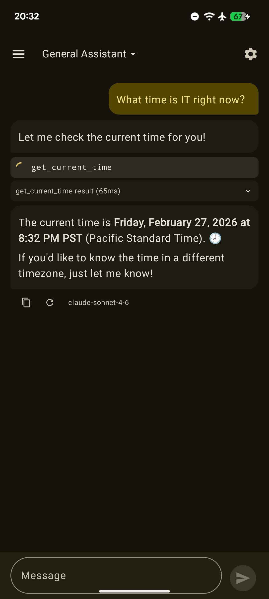

ToolCallCard 可见，显示 `get_current_time` 及加载动画。其下方 ToolResultCard 显示：`get_current_time result (65ms)`。AI 最终回复："The current time is **Friday, February 27, 2026 at 8:32 PM PST**."


完整对话已完成。操作行含复制、重新生成和 `claude-sonnet-4-6` 模型标签。

---

### Flow 1-8：错误消息 — 错误卡片和重试按钮可见

**结果：** PASS

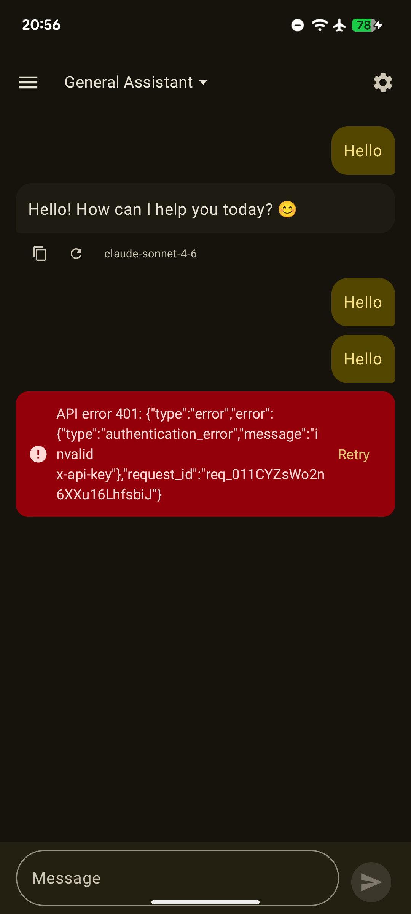

红色错误卡片可见：`API error 401: {"type":"error","error":{"type":"authentication_error","message":"invalid x-api-key"}...}`。右侧显示**重试**按钮，左侧显示错误图标。


点击重试后：同样的错误再次出现（密钥仍无效 — 符合预期）。确认重试按钮可触发新的请求。

---

### Flow 1-9：思考块 — 折叠与展开

**结果：** PASS（本次 session 修复 Bug）

**思考块折叠状态：**

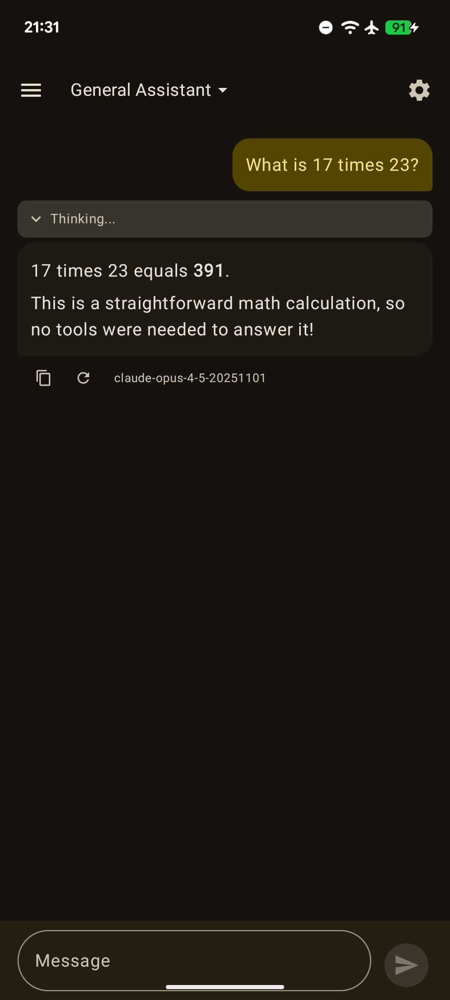

AI 响应气泡上方可见折叠的"Thinking..."块。模型标签 `claude-opus-4-5-20251101`。

**思考块展开状态：**

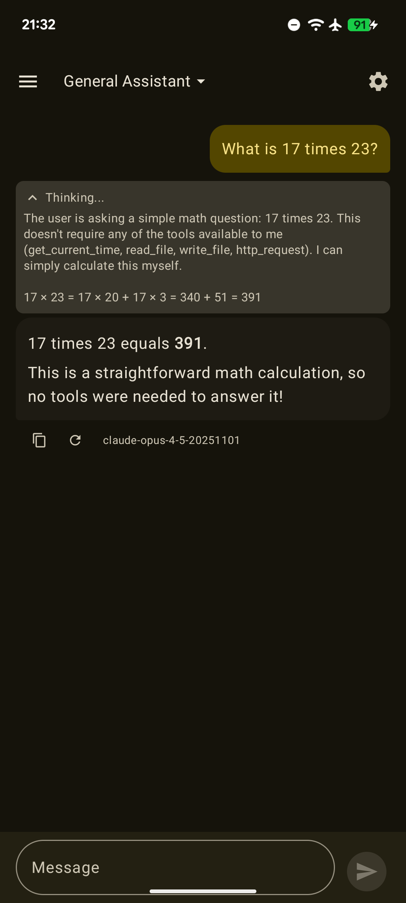

块展开，显示完整推理过程：模型逐步计算 `17 × 23 = 17 × 20 + 17 × 3 = 340 + 51 = 391`。

**再次折叠：**

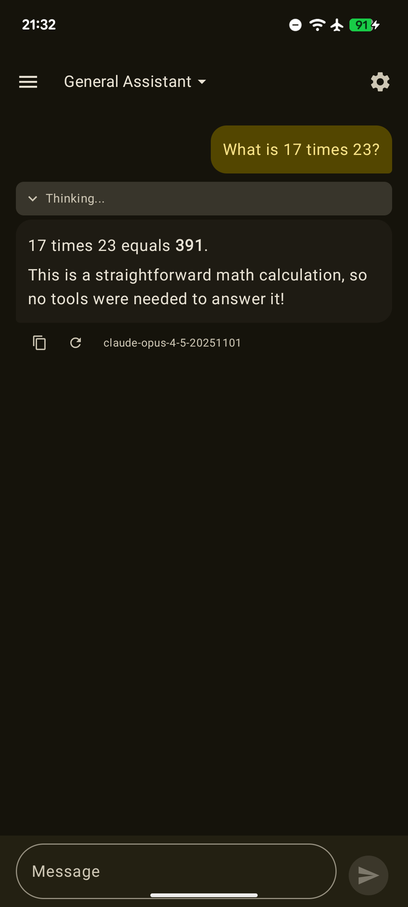

第二次点击后块再次折叠。

**修复方案：** 在 `AnthropicAdapter.kt` 的 `buildAnthropicRequest()` 中，为模型 ID 含 `"opus-4"` 或 `"sonnet-4"` 的模型添加 `"thinking": {"type": "enabled", "budget_tokens": 10000}` 至请求体，并将 `max_tokens` 从 `8192` 提升至 `16000`。原先仅发送了 `anthropic-beta` 请求头，但缺少必要的请求体配置。

---

## 发现的问题

### [BUG — 已修复] 软键盘弹出时顶部导航栏被推出屏幕（Flow 1-5）

**状态：** 已修复

**根因：** `windowSoftInputMode` 未设置，默认采用 `adjustPan` 将整个窗口向上移动。修复：在 Manifest 中设置 `adjustNothing`，并仅在 `ChatInput` 底部栏应用 `imePadding`。

---

### [BUG — 已修复] 长按用户消息打开 Agent 选择器而非复制（Flow 1-6）

**状态：** 已修复

**根因：** Android 16 在 `combinedClickable.onLongClick` 触发前，会拦截 `Text` 上的长按事件用于系统文字选择。修复：用 `DisableSelection {}` 包装 `Text`，并为 `combinedClickable` 传入显式 `interactionSource` + `indication = null`。

---

### [BUG — 已修复] 思考块从不出现（Flow 1-9）

**状态：** 已修复

**根因：** 发送了 `anthropic-beta: interleaved-thinking-2025-05-14` 请求头，但请求体中缺少必需的 `"thinking": {"type": "enabled", "budget_tokens": N}` 字段。修复：在 `buildAnthropicRequest()` 中为有能力的模型添加 thinking 配置。

---

### [小问题] 错误卡片显示原始 JSON（Flow 1-8）

**严重程度：** 低 — 功能正常但不够友好。

**描述：** API 错误发生时，错误卡片显示原始 JSON 错误体（如 `API error 401: {"type":"error","error":{"type":"authentication_error",...}}`）。预期行为是显示易读的消息，例如"API 密钥无效或已过期"。

**状态：** 本次 session 未修复。待后续 RFC 或补丁处理。

---

### [外观] 数学符号渲染

LaTeX 风格公式渲染为纯文本。`compose-markdown` 库的已知限制，不属于回归问题。

## 变更记录

| 日期 | 变更 |
|------|------|
| 2026-02-27 | 初始报告 |
| 2026-02-27 | 在 Pixel 6a 上执行 Layer 2 Flow 1-1；章节从 SKIP 更新为 PASS |
| 2026-02-27 | 在 Pixel 6a 上执行 Flow 1-2；FAIL — 键盘弹出后顶部导航栏被推出屏幕；已记录 Bug |
| 2026-02-27 | 执行 Flow 1-2 至 1-9；发现并修复 3 个 Bug（键盘 insets、长按复制、思考块）；全部流程通过；Layer 2 结果更新为 PASS |
