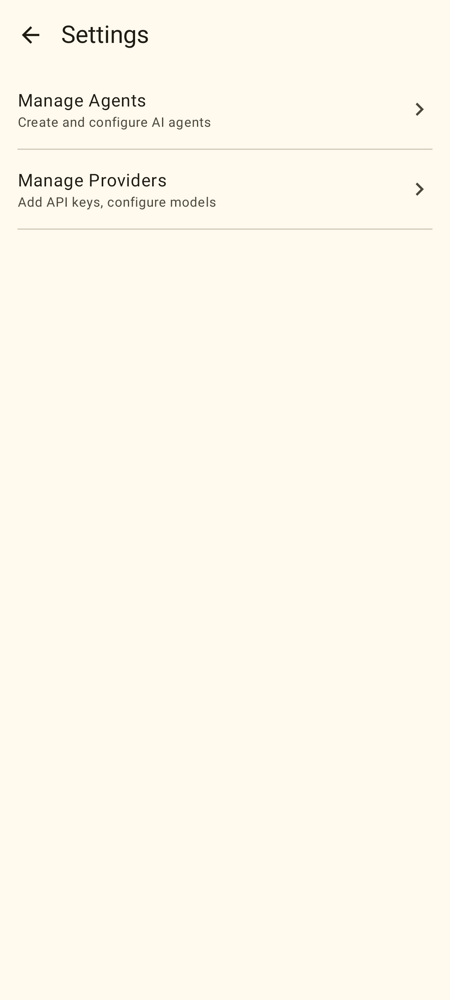

# 测试报告：第 1–3 阶段 — 项目基础 + RFC-003 + RFC-004

## 报告信息

| 字段 | 内容 |
|------|------|
| 覆盖阶段 | 第 1 阶段（项目基础）、第 2 阶段（RFC-003 Provider 管理）、第 3 阶段（RFC-004 Tool 系统） |
| 关联 FEAT | FEAT-003、FEAT-004 |
| Commits | `02e44d7`、`70a350f`、`10ebbbd`、`ca5e281`、`4dbe9c3` |
| 日期 | 2026-02-27 |
| 测试人 | AI (OpenCode) |
| 状态 | 部分通过 — 第二层跳过（Chat 功能尚未实现） |

## 摘要

第 1–3 阶段完成了项目的完整基础架构、Provider 管理（RFC-003）和 Tool 系统（RFC-004）的实现。本报告涵盖第 3 阶段完成后执行的所有第一层测试。

| 层级 | 步骤 | 结果 | 备注 |
|------|------|------|------|
| 1A | JVM 单元测试 | 通过 | 181 个测试（包含所有已实现 RFC） |
| 1B | 设备 DAO 测试 | 通过 | 47 个 DAO 测试，在 emulator-5554 运行 |
| 1B | 设备 UI 测试 | 跳过 | 暂未编写 Compose androidTest |
| 1C | Roborazzi 截图测试 | 通过 | 5 张基线截图，已记录并验证 |
| 2 | adb 视觉验证 | 跳过 | RFC-001（Chat）尚未实现；Flow 1 部分可用但推迟执行 |

## 第一层 A：JVM 单元测试

**命令：** `./gradlew test`

**结果：** 通过

**测试数量：** 181 个测试，0 个失败

各 RFC 测试类分布：

**第 1 阶段（基础）：**
- `ModelApiAdapterFactoryTest` — 3 个测试
- `OpenAiAdapterTest`、`AnthropicAdapterTest`、`GeminiAdapterTest` — 适配器单元测试
- 各 model/repository 单元测试 — 第 1 阶段约 57 个测试

**RFC-003 Provider 管理：**
- `TestConnectionUseCaseTest` — 成功、无 API key、网络失败
- `FetchModelsUseCaseTest` — 获取+保存、失败时降级
- `SetDefaultModelUseCaseTest` — 成功、model 不存在、Provider 未激活
- `ProviderListViewModelTest` — 从 repository 加载 provider 列表
- `ProviderDetailViewModelTest` — 各操作的状态更新
- `FormatToolDefinitionsTest` — 3 个适配器的 tool 定义格式化

**RFC-004 Tool 系统：**
- `ToolRegistryTest` — 4 个测试：注册、检索、获取全部、按 ID 获取
- `ToolSchemaSerializerTest` — schema 序列化
- `ToolExecutionEngineTest` — 6 个测试：成功、未找到、不可用、超时、权限拒绝、异常捕获
- `GetCurrentTimeToolTest` — 3 个测试：默认时区、指定时区、无效时区
- `ReadFileToolTest` — 2 个测试：读取文件、文件不存在报错
- `WriteFileToolTest` — 2 个测试：写入文件、写入失败报错
- `HttpRequestToolTest` — 4 个测试：GET 请求、响应截断、网络失败、超时

## 第一层 B：设备端测试

**命令：** `ANDROID_SERIAL=emulator-5554 ./gradlew connectedAndroidTest`

**结果：** 通过

**设备：** 模拟器 `Medium_Phone_API_36.1`，Android 16，API 36

**测试数量：** 47 个测试，0 个失败

测试类：
- `AgentDaoTest` — 8 个测试
- `ProviderDaoTest` — 9 个测试（修复：方法名 `deleteCustomProvider`）
- `ModelDaoTest` — 8 个测试
- `SessionDaoTest` — 10 个测试
- `MessageDaoTest` — 7 个测试
- `SettingsDaoTest` — 5 个测试

**备注：** `ProviderDaoTest` 存在 Bug（调用了 `delete()` 而非 `deleteCustomProvider()`），已在 commit `4dbe9c3` 修复。

## 第一层 C：Roborazzi 截图测试

**命令：**
```bash
./gradlew recordRoborazziDebug
./gradlew verifyRoborazziDebug
```

**结果：** 通过

**测试文件：** `app/src/test/kotlin/com/oneclaw/shadow/screenshot/ProviderScreenshotTest.kt`

**配置说明：**
- 将 `compose.ui.test.junit4` 添加到 `testImplementation`（之前仅在 `androidTestImplementation`）
- 添加 `junit-vintage-engine` 运行时依赖，支持 JUnit 4 和 JUnit 5 共存
- 在测试类添加 `@Config(application = Application::class)`，绕过 Robolectric 环境下 `OneclawApplication.startKoin()` 重复启动问题
- 从 `ProviderListScreen` 中提取出公开的无状态 composable `ProviderListScreenContent()`

### 截图

#### SettingsScreen — 默认状态



视觉检查：顶部显示"Settings"标题和返回箭头，列表有"Manage Providers"条目，副标题"Add API keys, configure models"，右侧有箭头。布局清晰，符合预期。

#### ProviderListScreen — 已填充状态（3 个 Provider）


视觉检查：顶部"Providers"标题和"+"按钮，"BUILT-IN"分区标题，三行：OpenAI（4 个模型，红色"Disconnected"标签）、Anthropic（2 个模型，灰色"Not configured"标签）、Google Gemini（2 个模型，紫色"Connected"标签）。状态颜色符合 Material 3 主题。

#### ProviderListScreen — 加载状态


视觉检查：顶部"Providers"和"+"按钮可见，屏幕中央显示一个蓝色圆点（CircularProgressIndicator 初始帧）。加载状态正确。

#### ProviderListScreen — 空列表状态


视觉检查："Providers"标题，内容区域居中显示"No providers available."文本。空状态正确。

#### ProviderListScreen — 深色主题


视觉检查：黑色背景，白色文字，"Anthropic"行显示紫色"Connected"标签。深色主题渲染正确。

## 第二层：adb 视觉验证

**结果：** 跳过

**原因：** RFC-001（Chat 交互）尚未实现。完整的 App 流程（Setup → Chat → Provider 配置）还无法端到端验证。第二层 Flow 1（首次启动 + Provider 设置）将在 RFC-001 或 Setup/导航流程完善后执行。

环境变量中已有 API key（`ONECLAW_ANTHROPIC_API_KEY` 等），但 App 当前在 Setup 完成后仅显示占位符 Chat 界面，进行视觉验证为时过早。

## 发现的问题

| # | 描述 | 严重程度 | 状态 |
|---|------|----------|------|
| 1 | `ProviderDaoTest` 中方法名错误：调用 `delete()` 而非 `deleteCustomProvider()` | 中 | 已在 `4dbe9c3` 修复 |
| 2 | `compose.ui.test.junit4` 未加入 `testImplementation`，导致 Roborazzi 测试编译失败 | 中 | 已在 `4dbe9c3` 修复 |
| 3 | Robolectric 每个测试方法都触发 `OneclawApplication.startKoin()`，引发 `KoinAppAlreadyStartedException` | 中 | 已通过 `@Config(application = Application::class)` 在 `4dbe9c3` 修复 |

## 变更历史

| 日期 | 变更内容 |
|------|----------|
| 2026-02-27 | 初始版本，覆盖第 1–3 阶段 |
